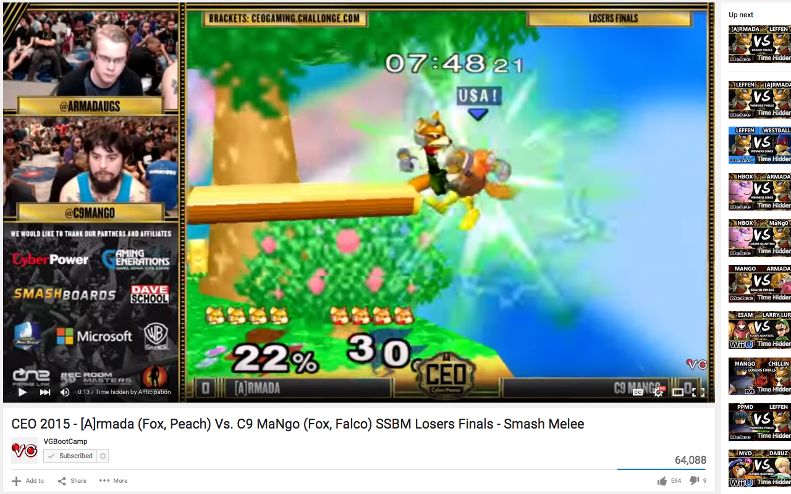

Anticipation for YouTube
=============

Hides video time on YouTube

Anticipation for Youtube hides the video time and progress bar on Youtube, along with the times of related videos on the page, so the user does not know how much time is left in a video.

Anticipation is useful when watching sports or other types of competitions when the amount of time left might give away the result of the sport, match, or competition.

https://addons.mozilla.org/en-US/firefox/addon/anticipation-for-youtube/

Chrome Version
---------------

Can be found here: https://github.com/krishmasand/Anticipation-Chrome

Safari Version
--------------

Can be found here: https://github.com/krishmasand/Anticipation-Safari
